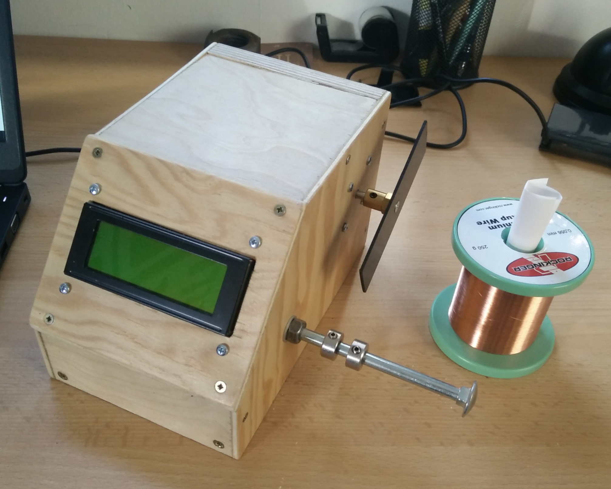

# Pickup Winder

Software for an arduino-based machine to wire electromechanical pickups. Can be used to wire guitar pickups. I build to wire pickups for an electric ukulele I build.

It has two arduino boards. One to drive the stepper motor and one for all controlls and user-interfaces. This is needed, because it uses bit-banging to generate the clock for the stepper motor. Time intensive tasks, like sending I2C messages to the display, would block this clock and led to interrupted rotations.

The motor-arduino is controlled with 4 pins. Each represents one bit of the 4-bit encoded speed, the motor should run. The motor-board uses a fifth pin, to tell the controller-board, when the motor has turned one full rotation. Like this it is possible to count the rotations and show them on the display.
